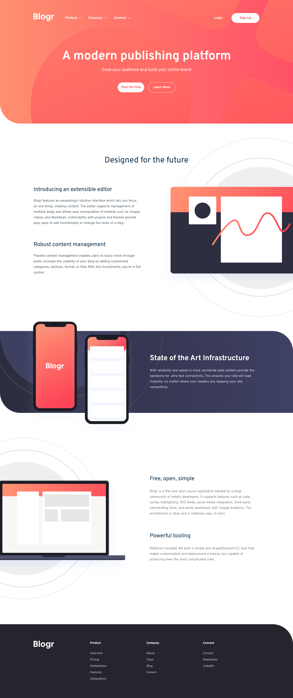

# Frontend Mentor - Blogr landing page solution

This is a solution to the [Blogr landing page challenge on Frontend Mentor](https://www.frontendmentor.io/challenges/blogr-landing-page-EX2RLAApP). Frontend Mentor challenges help you improve your coding skills by building realistic projects.

## Table of contents

- [Overview](#overview)
  - [The challenge](#the-challenge)
  - [Screenshot](#screenshot)
  - [Links](#links)
- [My process](#my-process)
  - [Built with](#built-with)
  - [What I learned](#what-i-learned)
  - [Continued development](#continued-development)
- [Author](#author)

## Overview

Flex your layout muscles with this landing page challenge. You'll mostly be working with HTML & CSS for this project with a tiny bit of JS for the mobile menu.

### The challenge

Users should be able to:

- View the optimal layout for the site depending on their device's screen size
- See hover states for all interactive elements on the page

### Screenshot

### Links

- Solution URL: [Add solution URL here](https://achrustowski.github.io/blogr-landing-page-main/)
- Live Site URL: [Add live site URL here](https://achrustowski.github.io/blogr-landing-page-main/)

## My process

Custom variables for styling and setting the backgrounds for desktop view. Mix of Flex and Grid. A little bit of issues with mobile-nav (I failed to plan correctly my HTML in that area).

### Built with

- Semantic HTML5 markup
- CSS custom properties
- Flexbox
- CSS Grid
- Mobile-first workflow

### What I learned

I learned the hard way what happens when you incorrectly set containers for your nav... Had a real struggle fixing mobile-nav and ended up having to create new code especially for the mobile view.

I also learned to put more effort in using custom variables for padding as I ended up having to go back and forth creating multiple media queries that essentially had just padding in them.

I also learned to organise media queries in a more readable way and to avoid re-writing media queries.

### Continued development

Flex, Grid, media queries, custom variables.

## Author

- Frontend Mentor - [@achrustowski](https://www.frontendmentor.io/profile/achrustowski)
- GitHub - [@achrustowski](https://github.com/achrustowski)
